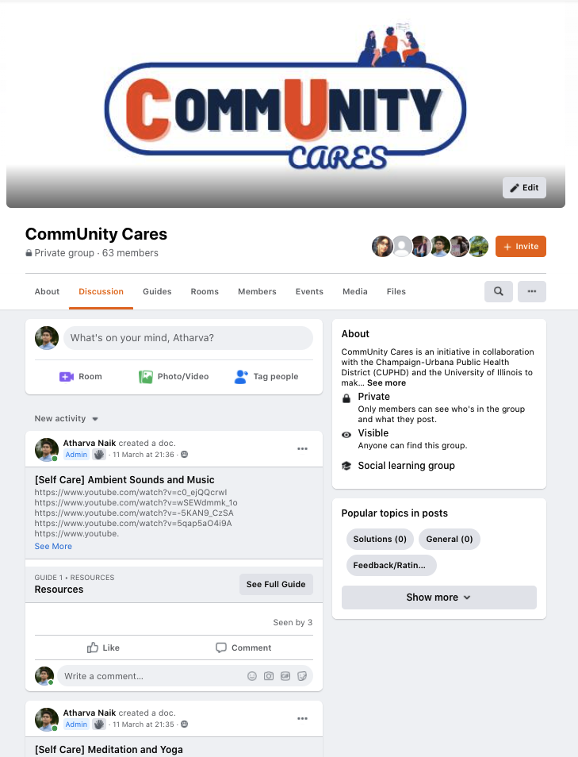

# Spring 2021: Champaign-Urbana Public Health District

During my first year in GLP (2020-2021), also the first-year of the program itself, my group was tasked with working with the Champaign-Urbana Public Health District (CUPHD) as our community sponsor. Our design challenge was to research and ideate best practices for building community capacity (using both local and international models) to address mental health during COVID-19, to determine what our next steps should be to build capacity for our community, by our community in CU.

In particular, we were tasking with addressing the mental health fallout, and to come up with creative ways to provide resources to the community with virtually no budget. This was also my first time learning and using Human-Centered Design (HCD) in a practical application. After months of research, interviews, and ideation, our group came up with a comprehensive whitepaper to increase online resources provided by CUPHD in the form of a Facebook group along with an extensive collection of mental health resources.

This experience taught me skills in:

1. Human-Centered Design
2. Interviewing
3. Long-format presentations
